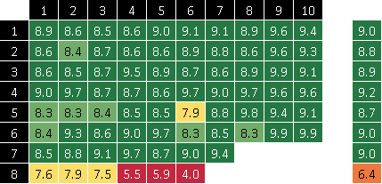

# chart-imdb

Chart a TV show's episodes by IMDB rating.

Downloads the episodes and their ratings from IMDB and then creates an chart image for those ratings.
The image is saved as a PNG file.

I wrote this over a couple of evenings. It comes as is and without warranty!

Example - Chart Game of Thrones Episodes:

	./chart tt0944947

Creates:

# Resources Used To Create This

[Python SpeedSheet](https://speedsheet.io/s/python)  
[Pillow SpeedSheet (Python Image Library)](https://speedsheet.io/s/pillow)  
[Beautiful Soup Sheet](https://speedsheet.io/s/beautiful_soup) 

# Run

	./chart imdb_show_code

Example (game of thrones):

	./chart tt0944947

# Install - MacOS / Linux

Create the virtual environment:

	python3 -m venv venv

Start the environment:

	. venv/bin/activate

Install the libraries:

	pip install -r requirements.txt
